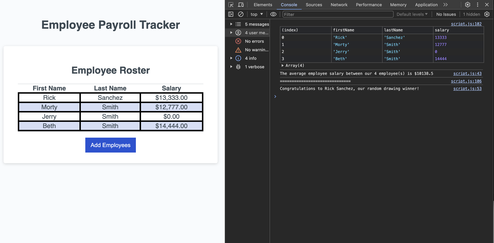

# Payroll Tracker

## Description

This is the Week 3 challenge where we are tasked with filling in the missing javascript code.

- Complete the collectEmployees() function
- Provide a prompt for first name, last name and salary.
- Provide a confirmation window after submitting the require payroll data.
- Using a template literal string, console log the employees average salary.
- Using a template literal string, console log a random employee name.
- Return data in the collectEmployees() function.

## Deployed URL

- https://rich-strain.github.io/payroll-tracking/

## Screenshot

